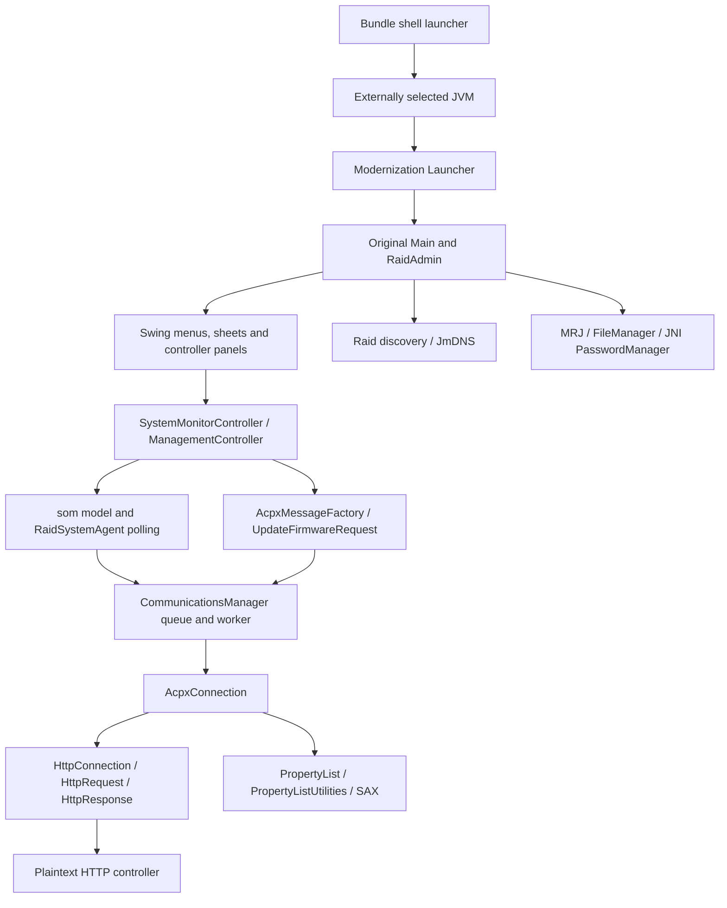

# Architecture and preservation boundaries

## File-level repository map

| File | Ownership / role | Observed limits |
|---|---|---|
| `original/RAID_Admin_original.jar` | Apple-origin candidate plus vendored Java dependencies; immutable hash-guarded input | Official acquisition and redistribution provenance unresolved |
| `original/RAIDAdmin.icns`, `RAIDAdminFirmware.icns` | Candidate original icons; match installed icons | Provenance inherited from repository |
| `patches/Launcher.java` | Modernization: Aqua/Swing color defaults, then calls original `com.apple.xsr.Main` | Catches and suppresses LAF exceptions |
| `patches/com/apple/eio/FileManager.java` | Modernization: folder mapping, Desktop/open URL bridge, file metadata no-ops | Ignores folder domain, missing original overloads, silent mkdir failure, metadata is not preserved |
| `patches/com/apple/mrj/MRJApplicationUtils.java` | Modernization: reflective Desktop/EAWT menu registration | Desktop exists on Java 8, but Java 9 handler classes do not; catches failures; quit/open-document/open-application are no-ops |
| `patches/sun/io/MalformedInputException.java` | Modernization: restores exception type required by legacy communications bytecode | Message constructor discards message; no controller implementation |
| `build.sh` | Modernization: compiler selection, destructive cleanup of local `build/`, JAR rewrite, plist, shell launcher, ad-hoc signature | Compiler/runtime fallback, ZIP timestamps, no lock/allowlist, signing failure hidden |
| `.gitignore` | Ignores generated builds/classes | New audit tooling also ignores Python caches |
| `README.md` | Upstream build/usage claims | Claims of all functionality/all firmware support are not qualification evidence |
| `tools/baseline.py` | New audit-only deterministic transformation and provenance | Exact local JDK lock, unsigned artifact, external-runtime launcher retained |
| `tools/diagnose.py` | New local artifact/interface metadata and allowlisted events | No discovery, credential stores, payloads or GUI |
| `tools/inventory.py` | New bytecode, resource-key, operation and dependency inventory | Static coverage, not runtime reachability proof |
| `tools/check_parity.py`, `tests/` | New network-denied serializer/replay, XML/API observations and unit tests | Limited synthetic coverage |

No native helper/source, native password library, entitlement file, bundled JRE, CI, release automation, notarization script, package installer or dependency manager existed at intake. The shell launcher is architecture-independent; native runtime support and Intel qualification are separate questions. Plist Bonjour/network/ATS declarations are metadata, not proof that macOS permission handling or Java sockets work.

## Application structure inside the immutable JAR

The static inventory covers all 656 `com.apple` and `com.chaotic` classes, 4,335 declared methods, and all 3,043 non-directory JAR entries. The core `com.apple.xsr` namespace has 558 classes. [UI-INVENTORY.md](audit/UI-INVENTORY.md) lists every core class, named action, request-factory call site and 1,207 global resource keys. [static-inventory.json](audit/static-inventory.json) supplies signatures, calls and hashes. This includes inner/anonymous classes so hidden and CLI paths are not dropped.

The class `RaidSystemAgent` defaults to 15,000 ms polling. `CommunicationsManager` serializes transactions and connection retries, with a 3,600,000 ms ceiling. Request factory plus firmware request classes define protocol messages; `AcpxConnection` adds ACP and controller-target headers; the custom HTTP implementation manages sockets. Responses use validating SAX and an embedded Apple plist DTD resolver; unknown external entities are not blocked.

The `som` package holds model/state and response mapping; `advanced` exposes slicing, expansion, masking and related settings; `firstaid` includes tests/scans and repairs; `eventlog` includes display, inspector, save and print; `update` handles chooser, bundle parsing, transfer and progress. `cli` has a separate command dispatcher, option parsing and many command handlers. CLI presence does not authorize executing commands against hardware.

## UI/operation coverage

Observed static surfaces include add/discover/direct IP/remove systems; monitoring and management authentication; forget password; update now; system/controller/drive/array/volume/environment/fibre-channel views; management system/network/password/cache/time and notification settings; create/delete/recognize/expand/slice arrays; LUN masking/assignment; consistency verification/recalculation and scans; diagnostic tests; identify/service LEDs and buzzer; event-log clear/save/print; restart/shutdown/reset; firmware selection/update; About/preferences/help/license, and CLI equivalents. Detailed signatures and literal controller commands are in the generated inventories.

**Unresolved:** complete user-action → authorization → command → response → terminal UI-state mapping still requires UI/runtime qualification and real sanitized controller fixtures. Static inventories are exhaustive within their stated extraction scope, but cannot establish which firmware/role makes each action available. No GUI was launched to avoid automatic discovery or polling of saved production targets.

## Preservation decision

Keep protocol/model/UI classes immutable for this milestone. The deterministic transformer verifies its input hash and the exact six-class output allowlist. A future overlay should be proven with class-origin/resource-loading tests before adoption; `java -jar` must not be assumed to honor a preceding patch classpath. Any OS-boundary fix should be a separate commit and test. Never duplicate the controller stack in a native helper.

The repository graph in the parent `graphify-out/` describes the six intake source/doc files only; README claims are marked unvalidated. It does not cover bytecode or the new audit tools, and is not the authoritative complete architecture inventory. Its hubs are FileManager and MRJApplicationUtils; no surprising cross-file edges were found. Token usage was unavailable and is labeled unknown.

## Runtime class-origin correction

[Java 8](audit/class-origin-java8.txt) and [Java 11](audit/class-origin-java11.txt) probes load classes without initializing the GUI. On both installed Corretto runtimes, `com.apple.eio.FileManager` is bootstrap-loaded, so the application-JAR replacement is shadowed. Launcher, MRJApplicationUtils, MalformedInputException and AcpxMessageFactory load from the application classpath. JAXP selects `org.apache.xerces.jaxp.SAXParserFactoryImpl`.

**Fact:** the FileManager patch is packaged but does not take effect on these tested runtimes. **Inference:** ordinary patch-JAR-first classpaths will not defeat bootstrap delegation; affected callers need a narrowly scoped bridge/call-site solution, or another explicitly qualified loading strategy. Do not silently inject boot-classpath overrides. This is why an overlay was not adopted merely on architectural preference.
