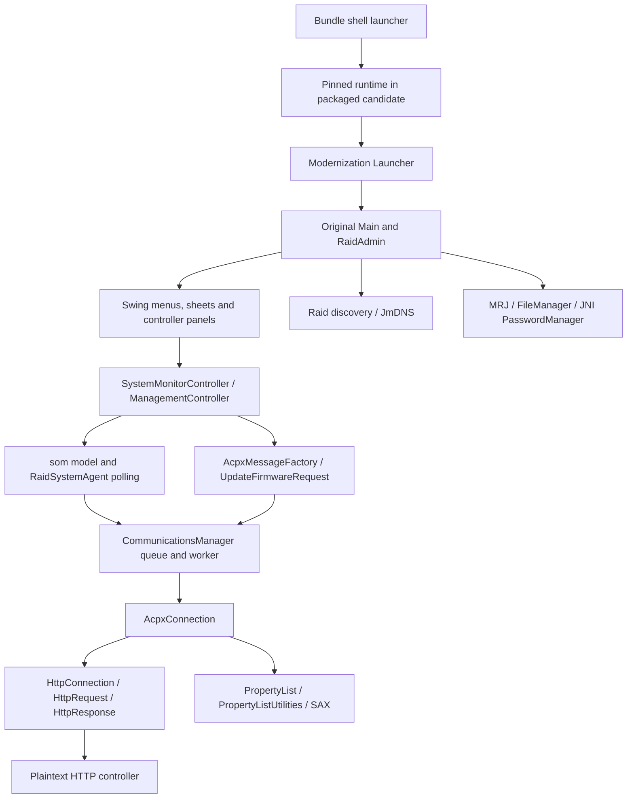

# Architecture and preservation boundaries

## File-level repository map

| File | Ownership / role | Observed limits |
|---|---|---|
| `original/RAID_Admin_original.jar` | Apple-origin candidate plus vendored Java dependencies; immutable hash-guarded input | Matches Apple-served 1.5.1 distribution; redistribution rights remain unresolved |
| `original/RAIDAdmin.icns`, `RAIDAdminFirmware.icns` | Candidate original icons; match installed icons | Provenance inherited from repository |
| `patches/Launcher.java` | Modernization: Aqua/Swing color defaults, then calls original `com.apple.xsr.Main` | Catches and suppresses LAF exceptions |
| `patches/com/apple/eio/FileManager.java` | Modernization: folder mapping, Desktop/open URL bridge, file metadata no-ops | Ignores folder domain, missing original overloads, silent mkdir failure, metadata is not preserved |
| `patches/com/apple/mrj/MRJApplicationUtils.java` | Modernization: reflective Desktop/EAWT menu registration | audit.3 selects EAWT/modern handler API correctly; original About/Prefs/Quit/OpenFiles callbacks forwarded; native event qualification open |
| `patches/com/apple/mrj/MRJFileUtils.java` | audit.2 single-method Desktop folder bridge | Other original stubs preserved; GUI callers not yet qualified |
| `patches/sun/io/MalformedInputException.java` | Modernization: restores exception type required by legacy communications bytecode | Message constructor discards message; no controller implementation |
| `patches/compat/SafePlistResolver.java` | Original local DTD with external-resolution rejection | XML resource limits and real response compatibility open |
| `patches/compat/SocketConfiguration.java` | audit23 initial read-timeout validation before publication; fixed IO detail with standard categories | Original Socket(host,80) DNS/TCP timing retained; cached setter and native socket behavior remain open |
| `patches/compat/SafeLogAppender.java` | Fixed severity signals without event rendering | Two synchronous writes maximum per process; GUI error states open |
| `build.sh` | Delegates to the deterministic hash-locked audit builder | Refuses existing output; no signing, install, launch or cleanup |
| `.gitignore` | Ignores generated builds/classes | New audit tooling also ignores Python caches |
| `README.md` | Upstream build/usage claims | Claims of all functionality/all firmware support are not qualification evidence |
| `tools/baseline.py` | New audit-only deterministic transformation and provenance | Exact local JDK lock, unsigned artifact, external-runtime launcher retained |
| `tools/diagnose.py` | New local artifact/interface metadata and allowlisted events | No discovery, credential stores, payloads or GUI |
| `tools/inventory.py` | New bytecode, resource-key, operation and dependency inventory | Static coverage, not runtime reachability proof |
| `tools/check_parity.py`, `tests/` | New network-denied serializer/replay, XML/API observations and unit tests | Limited synthetic coverage |

No native helper/source, native password library, entitlement file, bundled JRE, CI, release automation, notarization script, package installer or dependency manager existed at intake. The shell launcher and Java bytecode already accommodate Intel and Apple silicon through the installed runtime; preserve that support. Plist Bonjour/network/ATS declarations are metadata, not proof that macOS permission handling or Java sockets work.

Observed architecture coverage: the original and audit-built JARs produce identical
results in the ten-request serializer/HTTP-parser fixture on Corretto 8 arm64,
Corretto 11 arm64, and Corretto 11 x86_64 (Rosetta on this Apple silicon host).
Exact runtime and fixture hashes are in `audit/architecture-fixtures.json`;
`tools/check_architectures.py` repeats the observation with explicit runtime paths.
This does not qualify a physical Intel Mac, GUI integration, ACP transport,
controller behavior, or these old installed runtimes for release.

## Application structure inside the immutable JAR

The static inventory covers all 656 `com.apple` and `com.chaotic` classes, 4,317 declared methods, and all 3,043 non-directory JAR entries. The core `com.apple.xsr` namespace has 558 classes. [UI-INVENTORY.md](audit/UI-INVENTORY.md) lists every core class, named action, 350 request construction/factory/transport call sites and 1,207 global resource keys; initiation/confirmation classification remains open. [static-inventory.json](audit/static-inventory.json) supplies signatures, calls and hashes. This includes inner/anonymous classes so hidden and CLI paths are not dropped.

The class `RaidSystemAgent` defaults to 15,000 ms polling. `CommunicationsManager` serializes transactions and connection retries, with a 3,600,000 ms ceiling. Request factory plus firmware request classes define protocol messages; `AcpxConnection` adds ACP and controller-target headers; the custom HTTP implementation manages sockets. Responses use validating SAX and an embedded Apple plist DTD resolver; unknown external entities were permitted in the original and are blocked by the audit.4 resolver substitution.

The `som` package holds model/state and response mapping; `advanced` exposes slicing, expansion, masking and related settings; `firstaid` includes tests/scans and repairs; `eventlog` includes display, inspector, save and print; `update` handles chooser, bundle parsing, transfer and progress. `cli` has a separate command dispatcher, option parsing and many command handlers. CLI presence does not authorize executing commands against hardware.

## UI/operation coverage

Observed static surfaces include add/discover/direct IP/remove systems; monitoring and management authentication; forget password; update now; system/controller/drive/array/volume/environment/fibre-channel views; management system/network/password/cache/time and notification settings; create/delete/recognize/expand/slice arrays; LUN masking/assignment; consistency verification/recalculation and scans; diagnostic tests; identify/service LEDs and buzzer; event-log clear/save/print; restart/shutdown/reset; firmware selection/update; About/preferences/help/license, and CLI equivalents. Detailed signatures and literal controller commands are in the generated inventories.

**Unresolved:** complete user-action → authorization → command → response → terminal UI-state mapping still requires UI/runtime qualification and real sanitized controller fixtures. Static inventories are exhaustive within their stated extraction scope, but cannot establish which firmware/role makes each action available. No GUI was launched to avoid automatic discovery or polling of saved production targets.

## Preservation decision

Preserve controller command, model and UI implementation bytes. audit.4 makes three explicit Code-only substitutions: the plist entity resolver and two request diagnostic toString methods. Original class versions, constant-pool prefixes and every other method remain unchanged, checked independently with javap. The deterministic builder verifies exact input hashes and its complete changed-entry allowlist. A future overlay should be proven with class-origin/resource-loading tests before adoption; `java -jar` must not be assumed to honor a preceding patch classpath. Any OS-boundary fix should be a separate commit and test. Never duplicate the controller stack in a native helper.

The repository graph in the parent `graphify-out/` describes the six intake source/doc files only; README claims are marked unvalidated. It does not cover bytecode or the new audit tools, and is not the authoritative complete architecture inventory. Its hubs are FileManager and MRJApplicationUtils; no surprising cross-file edges were found. Token usage was unavailable and is labeled unknown.

## Runtime class-origin correction

[Java 8](audit/class-origin-java8.txt) and [Java 11](audit/class-origin-java11.txt) probes load classes without initializing the GUI. On both installed Corretto runtimes, `com.apple.eio.FileManager` is bootstrap-loaded, so the application-JAR replacement is shadowed. Launcher, MRJApplicationUtils, MalformedInputException and AcpxMessageFactory load from the application classpath. JAXP selects `org.apache.xerces.jaxp.SAXParserFactoryImpl`.

**Fact:** the FileManager patch is packaged but does not take effect on these tested runtimes. **Inference:** ordinary patch-JAR-first classpaths will not defeat bootstrap delegation; affected callers need a narrowly scoped bridge/call-site solution, or another explicitly qualified loading strategy. Do not silently inject boot-classpath overrides. This is why an overlay was not adopted merely on architectural preference.

## Review corrections implemented

`javap -classpath` had substituted the JDK FileManager for the archive class. The
inventory now disassembles explicit extracted `.class` files and flags 127
platform-name collisions. Earlier FileManager instruction/API conclusions from
that dump are withdrawn. `audit/os-boundary-original.txt` shows the original
FileManager is a stub, and `audit/installed-os-boundary.txt` describes the actual
installed replacement (not native JDK methods).

The request-site generator now includes MessageFactory interface calls, concrete
factory calls, RequestMessage constructor inheritance and transport sinks; the
previous empty table was a defect. Tests cover both invocation forms and reject
empty output. The 350 sites are structural evidence, not completed UI/automatic
path classifications.

`audit/folder-probe-before.json` establishes that runtime FileManager finds the
expected user preferences folder, while MRJFileUtils Desktop lookup returns null.
Runtime shadowing does not prove a broken boundary or favor transformation over
an overlay; both use the same parent-first loading rules.

## Logging preservation boundary

`audit/logging-boundaries.json` scans 2,844 classes and 24,032 methods across the
whole original JAR. Outside log4j internals, the only level-dependent direct calls
are INFO/DEBUG guards in five methods. audit.5 leaves those disabled while
enabling ERROR through the bounded fixed-code appender. The original logging
configuration is preserved except its root assignment and an appended appender
declaration; `audit/logging-patches.json` pins both versions. No other log4j
class or resource changes. Reflection/external reconfiguration remain outside
this static result. All controller command, polling and retry code is unchanged.

## Official distribution refinements

Apple’s 1.5.1 release notes explicitly remove LUN Masking from the Advanced panel.
The static catalog still contains related classes and request methods; their
presence is not evidence of intended visible UI. Preserve that distinction.
The official `.xfb` has update-image entries for the coprocessor and RAID
controller, with no coprocessor full-image key. The updater treats these manifest
keys conditionally and transmits from hardcoded updateROM.bin paths; the package
paths match those literals. No transmission was invoked.

## audit.6 security refinement

The user explicitly prioritized safe closure of the XML parser security gap.
A narrow parser-construction override selects the pinned bootstrap JDK provider,
retains the original plist Handler / DTD / serializer, enables validation, enforces
and verifies explicit quotas, and refuses external DTD/schema access. Provider
replacement and intentional security rejections are recorded in
[audit.6 parser evidence](audit/XML-PARSER-COMPATIBILITY.md). Controller commands,
polling and retry timing are unchanged. Production hardware approval remains absent.
Safe work continues with HTTP allocation/framing, firmware preflight and isolated
native UI qualification; successful parser fixtures do not close release acceptance.

audit.7 changes only two allocation operands in HttpResponse.getBody to a ByteArrayOutputStream subclass with a 16 MiB ceiling. Original branching, handlers and other methods remain. Fixed unchecked rejection maps to terminal -102 with no resend; measured persistent state prevents the observed next command before transmission, just as existing malformed numeric lengths do. See [scope](audit/HTTP-ALLOCATION-GUARD.md).

## audit.8 response header refinement

Line, count and aggregate header input are explicitly bounded through a three-byte
constructor insertion and per-response wrapper; original readLine/parseHeaders
remain unchanged. Exact limits and 174762 short-input/EOF cases pass on both pinned
runtimes. Queue rejection is terminal -102 with no replay, but the next command
still fails before sending: G14 recovery remains open. HTTP framing and actual
controller response compatibility are unqualified. See [scope and clean evidence](audit/HTTP-HEADER-GUARD.md).

## audit.9 security rejection recovery refinement

Body/header ceiling violations now close the rejected connection and return one
terminal -102 callback without replay. The next distinct queued command uses the
unchanged reconnect path; bounded offline fixtures pass on both architectures.
G14 is partially addressed: ordinary invalid numeric/negative lengths still leave
stale state and require the next security refinement. CLI direct-send lifecycle,
idle/paused polling, real TCP timing and controller behavior remain unqualified.
No third-party dependency is added. See [scope and evidence](audit/REJECTION-RECOVERY.md).

## audit.10 malformed length security refinement

Malformed, overflowing and negative exact Content-Length declarations now fail
once through the reviewed retirement path, with no resend and a fixed secret-free
message. The next distinct queued command succeeds through a fresh memory
connection. Valid Integer.parseInt parsing and original ordinary IO retries remain.
G14's demonstrated length-rejection stale state is addressed in bounded fixtures;
real/idle reconnect timing and CLI lifecycle remain unqualified. G10/G12 framing
and ambiguous IO replay remain open. Both runtime packages reproduce; no hardware,
installed-app modification or third-party dependency change occurred. See
[scope and evidence](audit/INVALID-LENGTH-GUARD.md).

## audit.11 explicit response framing

One ASCII-case-insensitive Content-Length is accepted; missing or duplicate
lengths and any Transfer-Encoding use a fixed terminal marker, close the
connection and return one -102 without failed-command replay in measured
send/dispatch fixtures. Single lowercase length now parses the actual plist;
canonical replies, legitimate zero length, ACP error codes and original ordinary
IO retries remain. Two same-length HttpResponse call substitutions and one small
helper implement the boundary. No third-party dependency is added.

G12 is only partially addressed: declared-zero with extra bytes remains a
measured association gap, status handling and malformed ordinary IO remain
legacy behavior, and no firmware capture proves single-length compatibility.
The HTTP protocol is plaintext. Native UI, physical Intel, hardware, signing and
release acceptance remain open. See [reviewed scope](audit/RESPONSE-FRAMING-POLICY.md).

## Offline firmware known-package foundation

A standalone bounded immutable-snapshot validator accepts only the checked Apple
1.5.1 XFB digest and emits reviewed public metadata. Unknown input never reaches
ZIP parsing/inflation; CLI/read errors use fixed codes. No application bytes,
updater calls, controller/cache operation or transmission change. This is partial
preflight groundwork: generic validation, Java send-time binding, confirmation
UI and hardware/version qualification remain open. See
[scope and review](audit/FIRMWARE-PREFLIGHT-FOUNDATION.md).

## audit.12 malformed-header security boundary

Colonless and leading-colon headers now produce a fixed terminal rejection,
retire the connection and return one -102 callback without command replay in
bounded memory fixtures. See [audit.12 evidence](audit/MALFORMED-HEADER-GUARD.md).
The controller outcome is unconfirmed; -102 does not prove a mutation was not applied.
Valid response behavior and unrelated IO retry paths remain unchanged. Null-message
IO worker death, other ambiguous mutation retries, incorrect single lengths,
trailing bytes, status interpretation and real controller/UI/CLI qualification
remain open. No installed application or production hardware is modified.

## audit.13 null-message dispatch recovery

The null-message IOException worker-death case now returns one fixed -102 with
an unconfirmed controller outcome and retires the connection in bounded fixtures.
A distinct next request succeeds. See [audit.13 evidence](audit/NULL-IO-RECOVERY.md).
Nonnull IO classification and retries remain original; broader ambiguous mutation
replay, GUI sequencing and real sockets remain open. Reflection-metadata failure
shuts dispatch down; original exit closes the source after terminal callbacks.
No production hardware, mounted volumes or installed application are exercised.

### audit.14 security-session containment

[audit.14 containment](audit/SECURITY-SESSION-CONTAINMENT.md) supersedes audit.12/13
next-request recovery for exact security markers. Local dispatch stops before
logging/callbacks, so already-queued dependent writes cannot proceed after an
unconfirmed outcome. No controller shutdown command is sent. Ordinary nonnull IO
replay remains open. Earlier isolated next-read success is historical evidence;
it is not the current containment behavior or whole-workflow qualification.

## Audit.15 no-replay refinement

[Ambiguous I/O containment](audit/AMBIGUOUS-IO-NO-REPLAY.md) intentionally removes
automatic resend for non-prefix I/O failures and stops the local session, including
failed reads. This supersedes audit.14 statements that ordinary nonnull I/O still
retries. Healthy replies and prefix -103 behavior remain original. Clean qualification passes on both pinned runtimes. See the linked evidence
for the 93-test suite, deterministic artifacts and narrowly stated limits. Prefix/generic failure sequencing,
synchronous cancellation/liveness, UI recovery and hardware acceptance remain open.

### Audit.16 worker-failure containment (clean fixtures)

The narrowly scoped audit.16 patch stops the local session before callbacks after
legacy prefix parse failures, typed malformed-input failures and generic worker
exceptions. It preserves their original result codes and exception objects;
healthy negative controller replies still permit the next request. This refines
the audit.15 statement that prefix behavior remains original: its error code is
preserved, but session continuation is deliberately removed for security.
Claude reviewed the design, implementation, follow-up and clean evidence; all six
qualification gates and 103 tests pass at clean source/fixture/package commit `727e5c4`. See [scope, evidence and remaining holes](audit/WORKER-FAILURE-STOP.md).
Interrupted synchronous waits, premature connection completion, queue exit races,
GUI recovery and hardware qualification remain unresolved. No controller command
or installed-app modification is part of this change.

### Audit.17 callback guard (clean fixtures)

A constructor-only defense removes enqueueing before the existing forbidden
synchronous-callback error. The memory differential shows the original queued
command later executing; the patch rejects before enqueueing while preserving
normal synchronous response identity and clone counts. This does not establish
original GUI reachability or fix interrupted waits and TYPE_CONNECT failure/later
transmission. Claude reviewed the design, implementation and clean evidence; seven gates and
108 tests pass at clean source/fixture/package commit `47166ed`. See [scoped evidence](audit/SYNC-CALLBACK-PREENQUEUE.md).

### Audit.18 initial connection failure stop (clean fixtures)

The worker now stops locally before publishing an initial connection failure,
preventing the held command from later executing after its caller receives an
error. The first silent dual-host fallback and retries with no published notice
remain; a stopped session requires a fresh Manager. Native GUI recovery is not
qualified. Nine gates, 112 Python tests and duplicate packages per architecture
pass at clean source/fixture/package commit `7aa02c5`; x64 runs under Rosetta.
See [scope and evidence](audit/CONNECT-FAILURE-STOP.md). No controller or installed
app was modified. Interrupted waits, synchronous enqueue/exit hangs, late async
posts, callback cleanup, lock ordering and hardware/release acceptance remain open.

### Audit.19 local stop lock ordering (clean fixtures)

Private stopped is volatile, and the worker's two queue-held reads avoid acquiring
the Manager monitor. Shutdown, callback timing and admission stay unchanged.
The isolated fixture proves completion and exact deadlock pairs when original
lock calls are restored. Ten gates, 118 tests and duplicate arm64/x64 packages pass
at clean source/fixture/package commit `6e2c210`. The first output-mismatch attempt
has an unresolved cause and is excluded; only the second plain set qualifies.
See [scope, limits and evidence](audit/STOP-LOCK-ORDER.md). Posting/exit stranding,
interrupted waits, callback failure cleanup, native GUI and hardware/release
acceptance remain open. No controller or installed-app modification occurred.

### Audit.20 stopped request admission (clean fixtures)

External posts to a locally stopped Manager are refused after the original clone,
under the queue lock. The lock is released before response delivery: SyncSender
is completed directly; other nonnull handlers are deferred to the EDT. The
worker retains its original enqueue/drain behavior. Deferred errors may update
the GUI/model where the old queue stayed silent, can precede older callbacks,
and can execute before a non-EDT poster returns; extension repost loops and
disposed AppContext delivery remain unqualified. Only Manager and two new
compatibility helper entries differ from audit.19; exact class reconstruction
checks unrelated logic. Eleven gates, 124 tests, 40 admission observations and
duplicate arm64/x64 packages pass at clean `b600ad3`; x64 is Rosetta.
See [scope, evidence and remaining gaps](audit/STOPPED-POST-ADMISSION.md).
Interrupted-wait ownership, abnormal worker exit, stop-versus-active-send,
native GUI, real hardware and signed release acceptance remain open. Original
JAR and installed application are preserved; legacy HTTP remains plaintext.

### Audit.21 ownership and terminal worker exit (local qualification)

Clean app source `ccf069f` and individually pinned clean fixtures `ccf069f`/`f0ca156`
pass twelve regression gates and 133 unit tests, including 120 worker, 46
connection-stop and 40 admission observations. Paired deterministic builds and
repeated ARM/x64 packages match; x64 execution is Rosetta. Claimed operations
wait for their actual outcome; terminal worker failure reports started work as
unconfirmed, drains unsent work without replay and contains callback failures
before arbitrary throwable logging. Exceptional cleanup callback thread/order
changes and best-effort limits are documented. See [scope and bound evidence](audit/WORKER-EXIT-QUALIFICATION.md).
Stop-versus-active-send, native GUI, physical Intel, real controller behavior and
signed release acceptance remain open. Original JAR and installed app are unchanged;
HTTP remains plaintext. Earlier milestones and failed/excluded attempts are historical.

### Audit.22 final stop admission (local qualification)

Clean application source `1e659d5` retains JAR
`202c9e1e0b5a7db39fc7a6ab17c46f0e1511cffbf9dcbdbe0199c1737147e9cd`.
Thirteen regression gates and 137 unit tests pass; 217 gate source hash entries
are verified. Twelve fixture records remain at `1e659d5`; clean QA `73ffa4e` makes
test JAR archives reproducible and reruns all 104 stop vectors. Only Manager
changes inside the application JAR from audit.21. A final volatile stop check
refuses unsent claimed work before exposure; admitted work retains its actual
reply or unconfirmed outcome. No command, polling interval or retry timing changes.
Paired builds and repeated ARM/x64 packages match bytes and modes; x64 is Rosetta.
Vendor runtimes are signature-verified; apps remain unsigned and unnotarized.
See [qualification, corrections and limits](audit/STOP-BEFORE-SEND.md) and the
[integrity ledger](audit/stop-admission-final-integrity.json).
Native GUI, physical Intel, controller behavior and release acceptance remain open.
No controller contact, production-volume test or installed-app change occurred.
HTTP remains plaintext. Earlier milestone records remain historical.

### Audit23 initial socket setup (local qualification)

Application source `f9a5edb`, QA source `96861bf`, JAR
`2fccbee50eb868a04b415085511e0b52e6a13682543858d6f653b7f1f5fcadad`.
Thirteen candidate regression gates plus one historical audit17 characterization,
140 unit tests, paired clean builds and repeated packages per architecture pass. Only HttpConnection.createSocket and one
new helper differ from audit22; all other JAR entry bytes are preserved.
Twenty-nine memory cases per runtime/mode and twelve mutants per architecture
qualify refused publication after failed/mismatched initial read-timeout setup.
Original Socket(host,80), ignored connect argument, DNS/TCP timing, command bytes,
polling and retry policy are retained. Standard IO categories retain fixed safe
error detail. This deliberately changes legacy error prose. HTTP remains plaintext.
See [scope, exclusions and reproduction](audit/SOCKET-CONFIGURATION.md) and
[record hashes](audit/socket-configuration-final-integrity.json). One first lock
fixture mismatch is excluded; an unchanged reduced-concurrency rerun passes,
with the first cause unresolved. x64 runs under Rosetta; native GUI, physical
Intel, controller workflows and release acceptance remain open. Cached timeout
setter, whole-operation/write bounds, mutable outbound inputs, status/empty-ack
interpretation and firmware file binding remain separate gaps. No controller,
production/mounted volume or installed-app modification occurred.

### Audit24 failed-open publication and LaunchServices arguments (local qualification)

Clean application, fixture and package source `8c246e1`, JAR
`9592145c933f611888a00cb159340a86f99d427672483701212023078f823553`.
Fourteen candidate regression gates and 146 unit tests pass; 290 gate source hash
entries are checked against their recorded clean Git commit and current bytes.
Only private AcpxConnection.createConnection changes inside the JAR from audit23:
open a local candidate once, publish only after success. Public timeout handling,
command bytes, polling and retries remain unchanged. Each candidate runtime/mode
covers 26 cases and 34 explicit failed-send attempts; four additional observations
characterize the actual audit23 reference. Eight interpreted negative controls
fail at their exact intended assertions. Direct post-newRequest failure recovery
remains unchanged and is not qualified by this fix.

The pinned-runtime launcher strips only one leading canonical legacy process
serial number, preventing that metadata from selecting CLI mode. All other
arguments remain exact. Its shell tests use a synthetic executable, not app Main.
Paired builds and repeated packages match bytes and file/directory modes on both
architectures; vendor runtime signatures verify. x64 execution is Rosetta, not
physical Intel. Apps remain unsigned and unnotarized. See
[audit scope and reproduction](audit/CONNECTION-PUBLICATION.md) and
[hash-bound evidence](audit/connection-publication-final-integrity.json).

Real hardware acceptance is deferred by the user's latest instruction, until an
actual operational need arises. No controller, production/mounted-volume test,
firmware transfer or installed-app modification occurred. Native GUI workflows,
physical Intel, signed release acceptance and controller behavior are unverified.
Separate offscreen native component probes are development-only, with no windows
shown or app Main/profile/controller access. HTTP remains plaintext.
