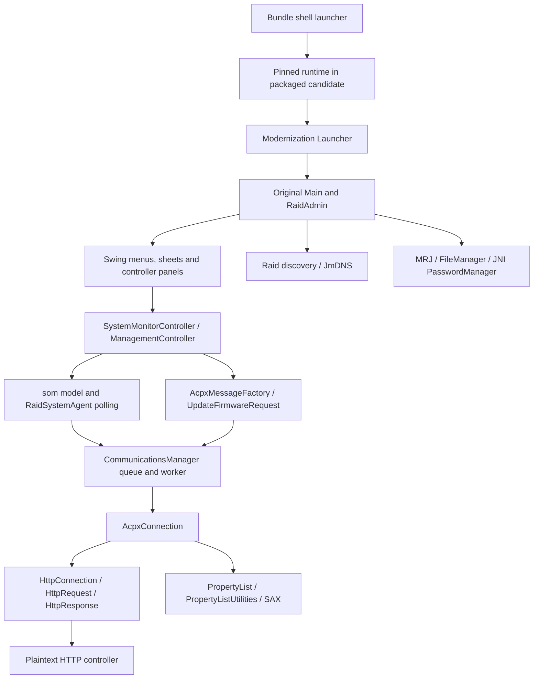

# Architecture and preservation boundaries

## File-level repository map

| File | Ownership / role | Observed limits |
|---|---|---|
| `original/RAID_Admin_original.jar` | Apple-origin candidate plus vendored Java dependencies; immutable hash-guarded input | Matches Apple-served 1.5.1 distribution; redistribution rights remain unresolved |
| `original/RAIDAdmin.icns`, `RAIDAdminFirmware.icns` | Candidate original icons; match installed icons | Provenance inherited from repository |
| `patches/Launcher.java` | Modernization: Aqua/Swing color defaults, then calls original `com.apple.xsr.Main` | Catches and suppresses LAF exceptions |
| `patches/com/apple/eio/FileManager.java` | Modernization: folder mapping, Desktop/open URL bridge, file metadata no-ops | Ignores folder domain, missing original overloads, silent mkdir failure, metadata is not preserved |
| `patches/com/apple/mrj/MRJApplicationUtils.java` | Modernization: reflective Desktop/EAWT menu registration | audit.3 selects EAWT/modern handler API correctly; original About/Prefs/Quit/OpenFiles callbacks forwarded; native event qualification open |
| `patches/com/apple/mrj/MRJFileUtils.java` | audit.2 single-method Desktop folder bridge | Other original stubs preserved; GUI callers not yet qualified |
| `patches/sun/io/MalformedInputException.java` | Modernization: restores exception type required by legacy communications bytecode | Message constructor discards message; no controller implementation |
| `patches/compat/SafePlistResolver.java` | Original local DTD with external-resolution rejection | XML resource limits and real response compatibility open |
| `patches/compat/SafeLogAppender.java` | Fixed severity signals without event rendering | Two synchronous writes maximum per process; GUI error states open |
| `build.sh` | Delegates to the deterministic hash-locked audit builder | Refuses existing output; no signing, install, launch or cleanup |
| `.gitignore` | Ignores generated builds/classes | New audit tooling also ignores Python caches |
| `README.md` | Upstream build/usage claims | Claims of all functionality/all firmware support are not qualification evidence |
| `tools/baseline.py` | New audit-only deterministic transformation and provenance | Exact local JDK lock, unsigned artifact, external-runtime launcher retained |
| `tools/diagnose.py` | New local artifact/interface metadata and allowlisted events | No discovery, credential stores, payloads or GUI |
| `tools/inventory.py` | New bytecode, resource-key, operation and dependency inventory | Static coverage, not runtime reachability proof |
| `tools/check_parity.py`, `tests/` | New network-denied serializer/replay, XML/API observations and unit tests | Limited synthetic coverage |

No native helper/source, native password library, entitlement file, bundled JRE, CI, release automation, notarization script, package installer or dependency manager existed at intake. The shell launcher and Java bytecode already accommodate Intel and Apple silicon through the installed runtime; preserve that support. Plist Bonjour/network/ATS declarations are metadata, not proof that macOS permission handling or Java sockets work.

Observed architecture coverage: the original and audit-built JARs produce identical
results in the ten-request serializer/HTTP-parser fixture on Corretto 8 arm64,
Corretto 11 arm64, and Corretto 11 x86_64 (Rosetta on this Apple silicon host).
Exact runtime and fixture hashes are in `audit/architecture-fixtures.json`;
`tools/check_architectures.py` repeats the observation with explicit runtime paths.
This does not qualify a physical Intel Mac, GUI integration, ACP transport,
controller behavior, or these old installed runtimes for release.

## Application structure inside the immutable JAR

The static inventory covers all 656 `com.apple` and `com.chaotic` classes, 4,317 declared methods, and all 3,043 non-directory JAR entries. The core `com.apple.xsr` namespace has 558 classes. [UI-INVENTORY.md](audit/UI-INVENTORY.md) lists every core class, named action, 350 request construction/factory/transport call sites and 1,207 global resource keys; initiation/confirmation classification remains open. [static-inventory.json](audit/static-inventory.json) supplies signatures, calls and hashes. This includes inner/anonymous classes so hidden and CLI paths are not dropped.

The class `RaidSystemAgent` defaults to 15,000 ms polling. `CommunicationsManager` serializes transactions and connection retries, with a 3,600,000 ms ceiling. Request factory plus firmware request classes define protocol messages; `AcpxConnection` adds ACP and controller-target headers; the custom HTTP implementation manages sockets. Responses use validating SAX and an embedded Apple plist DTD resolver; unknown external entities were permitted in the original and are blocked by the audit.4 resolver substitution.

The `som` package holds model/state and response mapping; `advanced` exposes slicing, expansion, masking and related settings; `firstaid` includes tests/scans and repairs; `eventlog` includes display, inspector, save and print; `update` handles chooser, bundle parsing, transfer and progress. `cli` has a separate command dispatcher, option parsing and many command handlers. CLI presence does not authorize executing commands against hardware.

## UI/operation coverage

Observed static surfaces include add/discover/direct IP/remove systems; monitoring and management authentication; forget password; update now; system/controller/drive/array/volume/environment/fibre-channel views; management system/network/password/cache/time and notification settings; create/delete/recognize/expand/slice arrays; LUN masking/assignment; consistency verification/recalculation and scans; diagnostic tests; identify/service LEDs and buzzer; event-log clear/save/print; restart/shutdown/reset; firmware selection/update; About/preferences/help/license, and CLI equivalents. Detailed signatures and literal controller commands are in the generated inventories.

**Unresolved:** complete user-action → authorization → command → response → terminal UI-state mapping still requires UI/runtime qualification and real sanitized controller fixtures. Static inventories are exhaustive within their stated extraction scope, but cannot establish which firmware/role makes each action available. No GUI was launched to avoid automatic discovery or polling of saved production targets.

## Preservation decision

Preserve controller command, model and UI implementation bytes. audit.4 makes three explicit Code-only substitutions: the plist entity resolver and two request diagnostic toString methods. Original class versions, constant-pool prefixes and every other method remain unchanged, checked independently with javap. The deterministic builder verifies exact input hashes and its complete changed-entry allowlist. A future overlay should be proven with class-origin/resource-loading tests before adoption; `java -jar` must not be assumed to honor a preceding patch classpath. Any OS-boundary fix should be a separate commit and test. Never duplicate the controller stack in a native helper.

The repository graph in the parent `graphify-out/` describes the six intake source/doc files only; README claims are marked unvalidated. It does not cover bytecode or the new audit tools, and is not the authoritative complete architecture inventory. Its hubs are FileManager and MRJApplicationUtils; no surprising cross-file edges were found. Token usage was unavailable and is labeled unknown.

## Runtime class-origin correction

[Java 8](audit/class-origin-java8.txt) and [Java 11](audit/class-origin-java11.txt) probes load classes without initializing the GUI. On both installed Corretto runtimes, `com.apple.eio.FileManager` is bootstrap-loaded, so the application-JAR replacement is shadowed. Launcher, MRJApplicationUtils, MalformedInputException and AcpxMessageFactory load from the application classpath. JAXP selects `org.apache.xerces.jaxp.SAXParserFactoryImpl`.

**Fact:** the FileManager patch is packaged but does not take effect on these tested runtimes. **Inference:** ordinary patch-JAR-first classpaths will not defeat bootstrap delegation; affected callers need a narrowly scoped bridge/call-site solution, or another explicitly qualified loading strategy. Do not silently inject boot-classpath overrides. This is why an overlay was not adopted merely on architectural preference.

## Review corrections implemented

`javap -classpath` had substituted the JDK FileManager for the archive class. The
inventory now disassembles explicit extracted `.class` files and flags 127
platform-name collisions. Earlier FileManager instruction/API conclusions from
that dump are withdrawn. `audit/os-boundary-original.txt` shows the original
FileManager is a stub, and `audit/installed-os-boundary.txt` describes the actual
installed replacement (not native JDK methods).

The request-site generator now includes MessageFactory interface calls, concrete
factory calls, RequestMessage constructor inheritance and transport sinks; the
previous empty table was a defect. Tests cover both invocation forms and reject
empty output. The 350 sites are structural evidence, not completed UI/automatic
path classifications.

`audit/folder-probe-before.json` establishes that runtime FileManager finds the
expected user preferences folder, while MRJFileUtils Desktop lookup returns null.
Runtime shadowing does not prove a broken boundary or favor transformation over
an overlay; both use the same parent-first loading rules.

## Logging preservation boundary

`audit/logging-boundaries.json` scans 2,844 classes and 24,032 methods across the
whole original JAR. Outside log4j internals, the only level-dependent direct calls
are INFO/DEBUG guards in five methods. audit.5 leaves those disabled while
enabling ERROR through the bounded fixed-code appender. The original logging
configuration is preserved except its root assignment and an appended appender
declaration; `audit/logging-patches.json` pins both versions. No other log4j
class or resource changes. Reflection/external reconfiguration remain outside
this static result. All controller command, polling and retry code is unchanged.

## Official distribution refinements

Apple’s 1.5.1 release notes explicitly remove LUN Masking from the Advanced panel.
The static catalog still contains related classes and request methods; their
presence is not evidence of intended visible UI. Preserve that distinction.
The official `.xfb` has update-image entries for the coprocessor and RAID
controller, with no coprocessor full-image key. The updater treats these manifest
keys conditionally and transmits from hardcoded updateROM.bin paths; the package
paths match those literals. No transmission was invoked.

## audit.6 security refinement

The user explicitly prioritized safe closure of the XML parser security gap.
A narrow parser-construction override selects the pinned bootstrap JDK provider,
retains the original plist Handler / DTD / serializer, enables validation, enforces
and verifies explicit quotas, and refuses external DTD/schema access. Provider
replacement and intentional security rejections are recorded in
[audit.6 parser evidence](audit/XML-PARSER-COMPATIBILITY.md). Controller commands,
polling and retry timing are unchanged. Production hardware approval remains absent.
Safe work continues with HTTP allocation/framing, firmware preflight and isolated
native UI qualification; successful parser fixtures do not close release acceptance.

audit.7 changes only two allocation operands in HttpResponse.getBody to a ByteArrayOutputStream subclass with a 16 MiB ceiling. Original branching, handlers and other methods remain. Fixed unchecked rejection maps to terminal -102 with no resend; measured persistent state prevents a subsequent command until recovery, just as existing malformed numeric lengths do. See [scope](audit/HTTP-ALLOCATION-GUARD.md).
